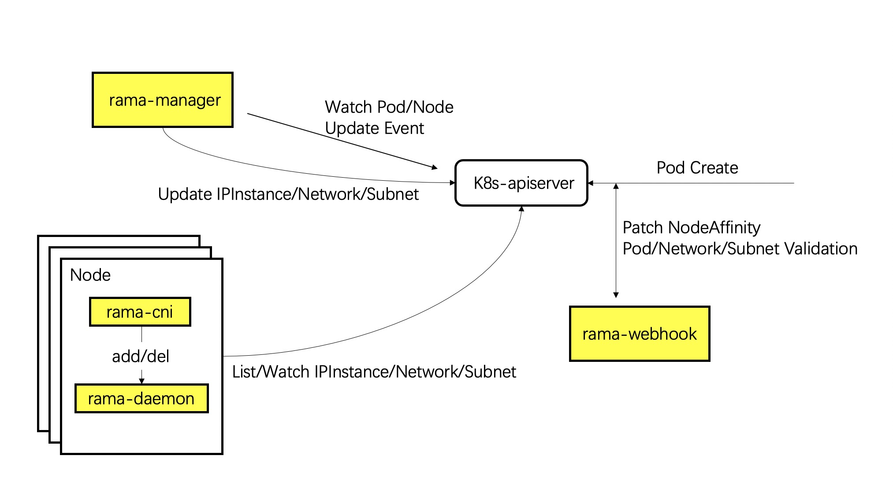

# Components

To deploy a Kubernetes cluster with Rama. Three components is needed:

## Rama-daemon

Rama-daemon controls the data plane configuration on every Node, e.g., iptables rule, policy routes, and apparently is deployed by a daemonset.

Rama-cni is a small CNI binary which plays a role adapting kubelet and rama-daemon. Actually it will not do anything but make a rpc call to rama-daemon by an unix domain socket.

## Rama-manager

Rama-manager is the ip address manager of Rama network. It watches pod creation/deletion and allocates/deletes ip address by controlling IPInstance CR. At the same time, rama-manager will also update status of all the CRs.

## Rama-webhook

Rama-webhook works as a validator and scheduler, it validates network configurations through a ValidatingWebhookConfiguration and participates in Pod scheduling through a MutatingWebhookConfiguration by patching node selector.

