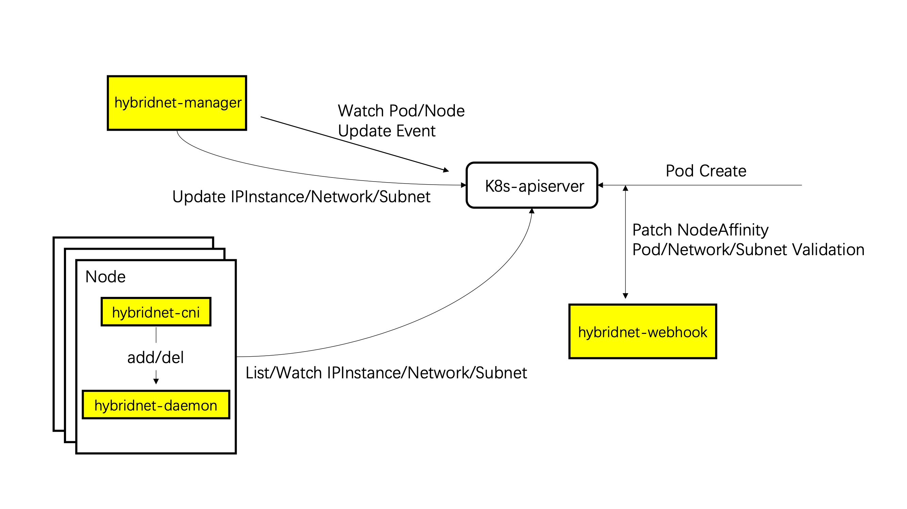

# Components

To deploy a Kubernetes cluster with Hybridnet. Three components is needed:

## Hybridnet-daemon

Hybridnet-daemon controls the data plane configuration on every Node, e.g., iptables rule, policy routes, and apparently is
deployed by a daemonset.

Hybridnet-cni is a small CNI binary which plays a role adapting kubelet and hybridnet-daemon. Actually it will not do anything but
make a rpc call to hybridnet-daemon by an unix domain socket.

## Hybridnet-manager

Hybridnet-manager is the ip address manager of Hybridnet network. It watches pod creation/deletion and allocates/deletes ip
address by controlling IPInstance CR. At the same time, hybridnet-manager will also update status of all the CRs.

## Hybridnet-webhook

Hybridnet-webhook works as a validator and scheduler, it validates network configurations through a
ValidatingWebhookConfiguration and participates in Pod scheduling through a MutatingWebhookConfiguration by patching
node selector.

