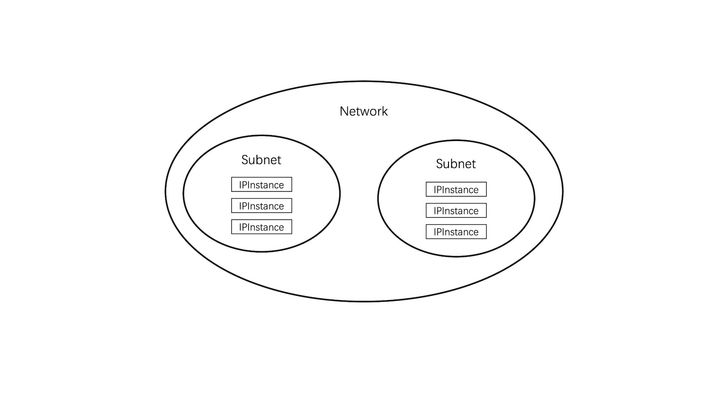

# CRD

Hybridnet uses three Kubernetes CRDs as operating interfaces: **Network**, **Subnet**, **IPInstance**. And these CRDs follow
a three-tier model:



## Network

A Network in Hybridnet is a "Pod Scheduling Domain", which refer to a series of Kubernetes Nodes with the same network
properties (e.g., attached to the same vlan, downlink of the same ASW). It means if a pod with a specific ip can be
scheduled to Node *A*, it can be scheduled to any Node belongs to the same Network with Node *A*.

Network is extremely important if you need an underlay container network, as taking care of Node's network environment
is always needed. For Hybridnet, which only provides a vlan type container network for now, a Network usually refers to a
series of Nodes with the same ASW or TOR. A Node can only exist in one underlay Network at the same time.

Here is a yaml of a Network CR for underlay container network:

```yaml
apiVersion: networking.alibaba.com/v1
kind: Network
metadata:
  name: network1
spec:
  netID: 0                      # Optional.
                                # For Underlay type, netID refers to vlan id and can be empty.
                                # If netID is empty, it means the subnets belong to this 
                                # network can have any netID but not empty. 
                                # If netID is not empty, all the subnets belong to this network
                                # can only has an empty or the same netID. 
                                
  type: Underlay                # Required. Underlay or Overlay
  
  nodeSelector:                 # Required only for underlay Network.
    network: "s1"               # Label to select target Nodes, which means every node blongs to 
                                # this network should be patched with this label.
```

But if you just need a overlay container network, things get easier. Because we don't even care about how the Node's
network going on, every node seems to get the same network properties. For such an overlay Network, every Node of the
Kubernetes cluster will be added to it automatically, and you don't need to configure it like applying an underlay
Network.

Here is the yaml for an overlay Network:

```yaml
---
apiVersion: networking.alibaba.com/v1
kind: Network
metadata:
  name: network1
spec:
  netID: 4                      # Required. 
                                # For Overlay type, netID refers to the tunnel id which used by vxlan
                                
  type: Overlay                 # Required. Underlay or Overlay
  
                                # For an overlay Network, .spec.nodeSelector need not to be set, which
                                # means every Node of the Kubernetes cluster will be added to it automatically.
```

Overlay and Underlay type Network can exist in one Kubernetes cluster at the same time, which we called a **Hybrid** mode.
While the maximum number of overlay Network is 1 for every cluster, and no limit for underlay Network.  

For Hybridnet, every Node of Kubernetes cluster should belong to at least one Network. If a Node does not belong to any
Network yet, it will be patched with a *taint* of *network-unavailable* automatically, which makes this node unschedulable.

## Subnet

A Subnet refers to an actual address range which pod can use. Every Subnet belongs to a Network, and supports some
features for flexible address management.

Here is a yaml for a Subnet:

```yaml
apiVersion: networking.alibaba.com/v1
kind: Subnet            
metadata:
  name: subnet1                 
spec:
  network: network1                                   # Required. The Network which this Subnet belongs to.
                               
  netID: 0                                            # Optional. Depends on the Network's configuration.
                                                      # If the Network's netID is emply, it should not be empty.
                                                      # If the Network's netID is not empty, it can only be
                                                      # empty or the same netID of Network.
                                                      # For an Overlay Network, this field must be empty.
                                                      
  range:
    version: "4"                                      # Required. Can be "4" or "6", for ipv4 or ipv6.
    
    cidr: "192.168.56.0/24"                           # Required.
    
    gateway: "192.168.56.1"                           # Optional. 
                                                      # For Underlay vlan Network, it refers to ASW gateway ip.
                                                      # Gateway address will never be allocated to pods.
                                
    start: "192.168.56.100"                           # Optional. The first usable ip of cidr.
    
    end: "192.168.56.200"                             # Optional. The last usable ip of cidr.
    
    reservedIPs: "192.168.56.101","192.168.56.102"    # Optional. The reserved ips for later assignment.
    
    excludeIPs: "192.168.56.103","192.168.56.104"     # Optional. The excluded ips for unusable. 
  config:
    autoNatOutgoing: false                            # Optional, Overlay Network only, Default is true. 
                                                      # If pods in this sunbet can access to addresses outside 
                                                      # the cluster by NAT.
    
    private: true                                     # Optional. Default is false.
                                                      # If addresses of the subnet can be allocated to pod
                                                      # without special assignment.
```

## IPInstance

An IPInstance refers to an actual ip assigned to pod by Hybridnet. IPInstance is not a configurable CRD and only for
monitoring, *DO NOT* edit it unless you know what you are doing.

Different from Network and Subnet, IPInstance is a namespace-scoped CRD (Network and Subnet is cluster-scoped).
Every IPInstance is in the same namespace with the pod it attached to.

